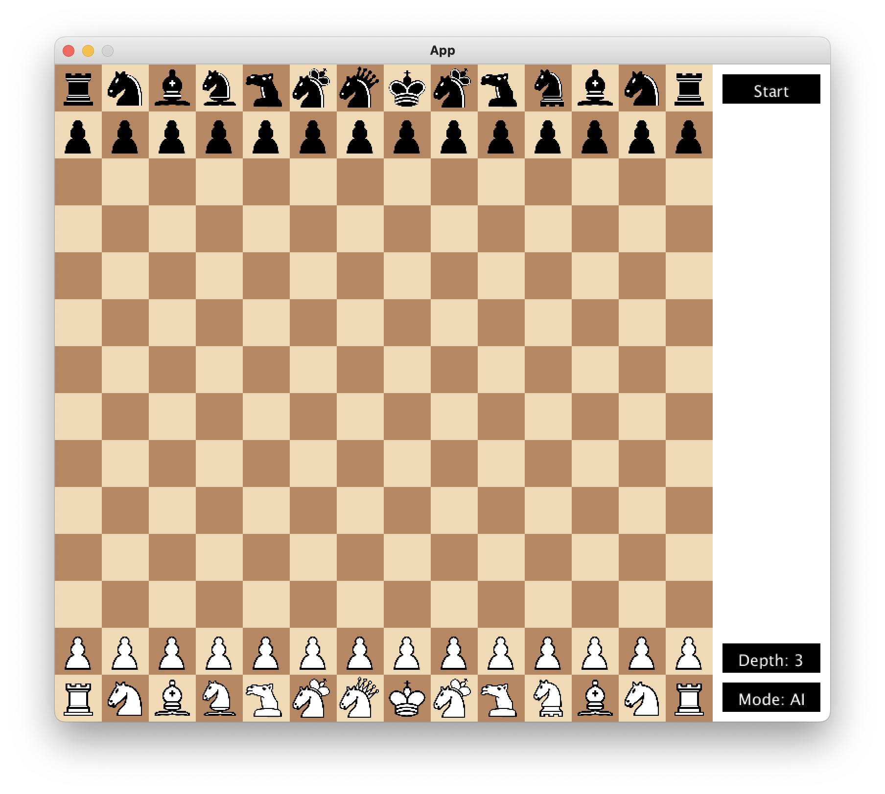
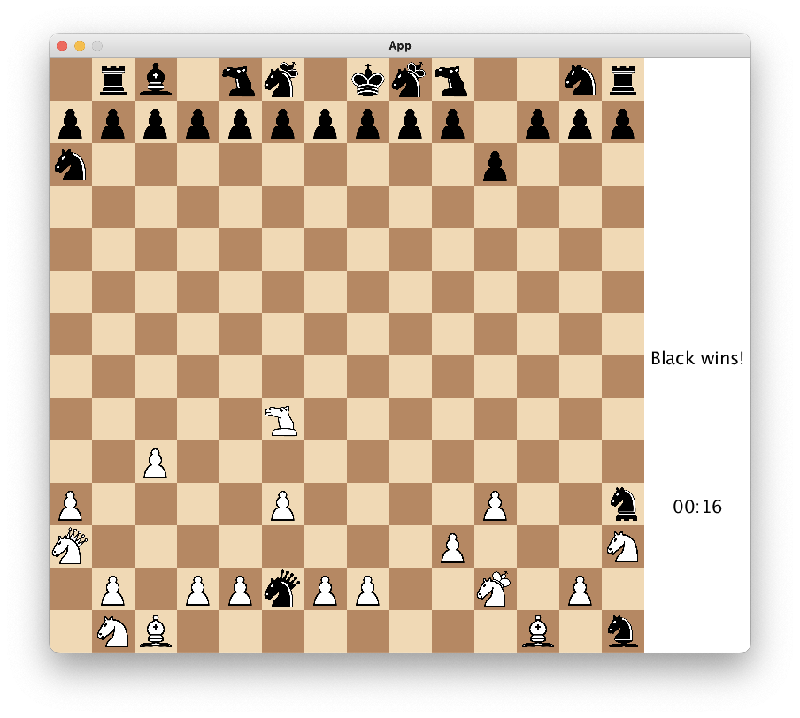

# Crux

## Description

Based on the classic game of Chess, Crux extends the board to 14x14 and introduces 5 new pieces: the Archbishop, the Camel, the Guard, the Amazon and the Chancellor. These pieces are a combination of existing pieces, and are designed to add a new layer of strategy to the game. Extending the program further, a Min-Max algorithm is implemented to allow the user to play against the computer with varying levels of difficulty. 

## Technologies

- Java
- Gradle
- Processing

## Features

- 5 new pieces
- 3 minute timer
- Min-Max algorithm
- 3 levels of difficulty
- 2 player mode

## Screenshots




## Usage

To run the program, navigate to the root directory and run the following command:

```bash
gradle run
```

## Installation

Prior to running the program, ensure that you have the following installed:

- Java 1.8
- Gradle 7.0
- Processing 3.3.7